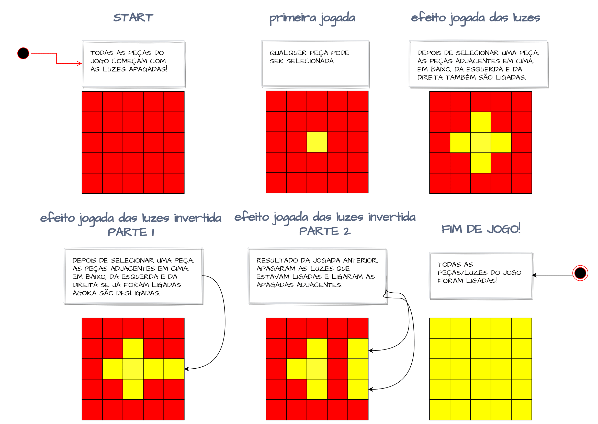

# Jogo das Luzes

O objetivo do Jogo das Luzes é transformar todas as peças vermelhas
 em amarelas, com o menor números de jogadas.

      :red_square: -> Luz apagada
      :yellow_square: -> Luz acesa

## Instruções do Jogo

Qualquer peça pode ser selecionada. Depois de selecionada as peças adjacentes em cima, em baixo da esquerda e da direita são comutadas, ou seja, o estado é alterado para aceso se estava apagado e vice-versa. O jogo termina se todas as peças foram 'ligadas' ou se as jogadas foram esgotadas.

A imagem abaixo ilustra as instruções e a dinâmica do jogo.

Bom divertimento!

## License

[MIT](https://choosealicense.com/licenses/mit/)

## Authors

- [@rafaael1](https://github.com/rafaael1)

## Contributing

Contributions are always welcome!